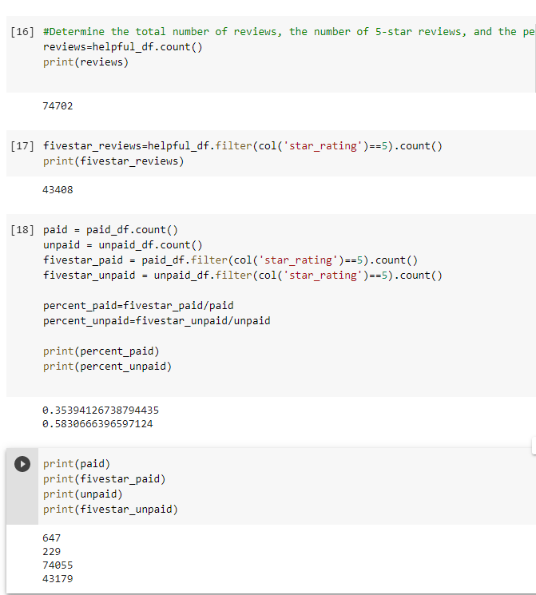

# Amazon_Vine_Analysis

## Overview of the analysis

The purpose of this analysis is to determine whether or not there is potentially positivity bias for the reviews in the Vine program for Amazon purchases in the beauty department. 

## Results

**How many Vine reviews and non-Vine reviews were there?**

There were a total of 74702 reviews that were considered helpful by at least 5 votes. Of these, a total of 647 were Vine reviews and 74055 were non-Vine reviews. 

**How many Vine reviews were 5 stars? How many non-Vine reviews were 5 stars?**

A total of 229 Vine reviews were 5 stars and 43179 non-Vine reviews were 5 stars. 

**What percentage of Vine reviews were 5 stars? What percentage of non-Vine reviews were 5 stars?**

Roughly 35% of Vine reviews were 5 stars and 58% of non-Vine reviews were 5 stars.

Please see all related supporting images pulled from dataframe calculations below: 

## Summary

In conclusion, there does not appear to be any positivity bias for reviews in the Vine program specific to the product line we've chosen, which is Beauty. This may be due to several reasons. Typically, shoppers that purchase beauty products from Amazon have found the product they want from other sources, and are less likely to be swayed by Vine reviews. This also goes to show that Vine program are typically used for products that have historically not been best selling, and as such shoppers are inclined to give fewer 5 star reviews after purchases because these are products that have never performed well for whatever reason. One additional analysis that I would love to do with the dataset to support my statement is to perform an analysis over the actual review language for negative/positive reviews. I hypothesis that the product lines within the vine program will likely have more negative reviews than positive ones. 
